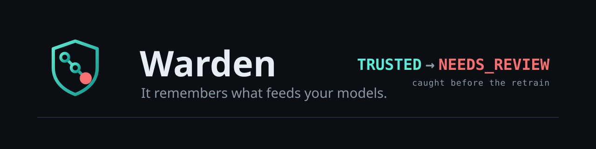
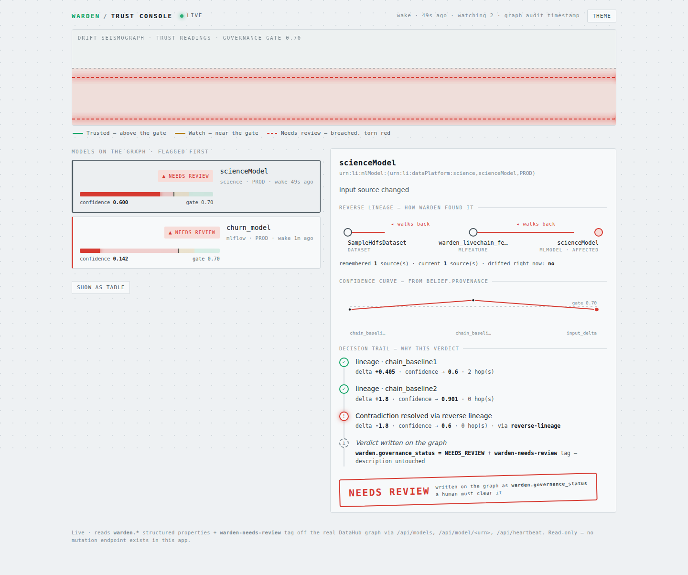

<p align="center">
  <picture>
    <source media="(prefers-color-scheme: dark)"  srcset="assets/banner-dark.svg">
    <source media="(prefers-color-scheme: light)" srcset="assets/banner-light.svg">
    
  </picture>
</p>

<p align="center">
  <b>A memory that lives on DataHub's graph and catches a silent upstream-source swap<br>
  every schema-diff misses — then writes the verdict back as governance a second, independent agent can trust.</b>
</p>

<p align="center">
  <a href="LICENSE"></a>
  
  
</p>

<p align="center">
  
  
  
  
  
</p>

<p align="center">
  <b>
  <a href="#the-problem">The&nbsp;problem</a> &nbsp;·&nbsp;
  <a href="#how-warden-catches-it">The&nbsp;catch</a> &nbsp;·&nbsp;
  <a href="#reproduce-it-yourself">Proof</a> &nbsp;·&nbsp;
  <a href="#under-the-hood">Architecture</a> &nbsp;·&nbsp;
  <a href="#status--limitations">Status</a> &nbsp;·&nbsp;
  <a href="docs/REPRODUCE.md">Reproduce</a>
  </b>
</p>

<p align="center">
  
</p>

<p align="center">
  <i>The Warden Trust Console — read-only, reading <code>warden.*</code> structured properties straight off the DataHub graph:
  a Drift Seismograph, a flagged model's reverse-lineage spine, and the decision trail behind its <code>NEEDS_REVIEW</code> verdict.</i>
</p>

<p align="center">
  <b>Category:</b> Production ML Agents &nbsp;·&nbsp; DataHub Agent Hackathon 2026 &nbsp;·&nbsp;
  Demo video <code>[VIDEO]</code> &nbsp;·&nbsp; Live Console <code>[LIVE-CONSOLE]</code> &nbsp;·&nbsp; OSS PR <code>[OSS-PR]</code>
</p>

---

> **Governance before AI.** Warden isn't a smarter model bolted onto DataHub — it's **context infrastructure**. The belief lives on the entity itself (typed structured properties), not in a prompt or a chat transcript, so it survives across runs and across agents. That is the whole point: it lets a *second, completely independent* agent trust the graph instead of re-deriving it from scratch every time. Memory store = DataHub's own graph, no side database, no GMS rebuild — proof (code): [`warden/memory.py`](warden/memory.py).

> ⚠️ **Read this before judging any claim below.** Every capability is marked either **✅ BUILT & live-verified** or **🚧 honest work-in-progress**, stated plainly in [Status & limitations](#status--limitations). Nothing here is claimed that the code doesn't do — the honesty is the point, not a disclaimer.

---

## The problem

A feature's **upstream source table gets silently re-pointed** — `fct_users_created` → `fct_users_created_v2` — while the feature's **name and description stay identical**. A schema-diff tool, a doc-linter, or a chat-with-your-metadata agent sees **nothing wrong**: same field names, same types, same description. But the model trained on that feature is now consuming a *different population*, silently. This is how target leakage and quiet accuracy decay get baked into a production model between two otherwise-unremarkable commits.

In production this never shows up as an outage. It shows up months later as *"why did this metric drift last quarter,"* after the bad model has already been serving traffic. A value- or PSI-drift monitor only alarms **after** bad data has been ingested and scored — it watches the *symptom*. **Warden watches the structure of what feeds the model** — a remembered source-set compared against live lineage — so it targets the root cause and catches the swap **before** the next training run ever touches it.

<p align="center"><b>Schema unchanged · source changed · caught.</b></p>

*(In the demo this exact pattern runs live on DataHub's stock sample graph — a silent `SampleHiveDataset → SampleHdfsDataset` re-point on `scienceModel`, the fixture every `datahub docker quickstart` ships — so it reproduces against a vanilla DataHub.)*

---

## How Warden catches it

Warden keeps a **per-asset memory that lives on the graph itself** — not in a side database, not in a chat transcript. When it revisits a model, it runs one clockwork loop:

1. **Loads its own prior belief** about the model's inputs (`warden.confidence`, `warden.provenance`, the remembered source-set) from DataHub structured properties on the entity.
2. **Compares that memory to live lineage** — the model's *actual current* upstream sources, walked through its `MLFeature → source-dataset` graph.
3. **Detects the delta a schema-diff cannot**: field names and types are unchanged, but the **source URN set changed**. That's the tell.
4. **Folds the delta into a Bayesian belief update** ([`confidence_model.py`](confidence_model.py)) — confidence drops below the governance threshold.
5. **Flags the model for human review instead of silently trusting it** — writes `warden.governance_status=NEEDS_REVIEW` + a `warden-needs-review` tag (visible in the DataHub UI) and **never rewrites the model's own description**.

Demonstrated end-to-end in [`run_ml_drift_demo.py`](run_ml_drift_demo.py): confidence visibly moves **`0.901 → 0.600`**, crossing the `0.7` gate, live against a running DataHub. *(That magnitude is prior-driven — the structural source-delta term. When a real PSI/KS score is available it feeds in as an additive term and the drop is measured, falling harder to `0.251` — see the [drift row](#status--limitations).)*

> **The killer moment.** A *second, foreign* agent — one that never saw Warden's code — reads only `warden.governance_status` off the graph and **refuses the flagged model**. The reference agent suggests once; Warden remembers, and a stranger's agent can trust what it wrote. That interop refusal is Gate 5 of the [live chain](#reproduce-it-yourself).

### Why a reference chat/analytics agent structurally can't do this

The reference `datahub-project/analytics-agent` pattern remembers the *conversation* (session history in a local DB) but keeps **no prior belief about the asset** to diff against — so it can describe the graph *as it is right now*, yet a same-name/same-description source swap is invisible to it by construction. Warden's moat isn't "we also have memory" — it's memory that **persists on the entity**, survives across runs, and is **compared against new evidence** on every revisit.

| Dimension | Reference-style chat agent | **Warden** |
|---|---|---|
| Memory | conversation history, local DB | per-asset, **on the DataHub graph** (structured properties) |
| Write-back | free-text descriptions | typed properties: confidence, log-odds, mass, provenance, summary |
| Belief update | none — no per-asset belief | **Bayesian log-odds**, re-scores on each revisit |
| Drift detection | none (nothing to diff against) | remembered source-set vs. live lineage, **unchanged-schema-safe** |
| Cross-asset synthesis | none | lineage-wide reflection, grounded in its own memories |
| Governance | none | **confidence-gated**: low confidence → visible `needs-review` signal, never auto-rewrites the model |

---

## Reproduce it yourself

Three honest proofs, not one number. All run live against a DataHub `docker quickstart`.

**① The end-to-end live chain — 17/17 gates green, idempotent.** One organic chain on DataHub's own sample graph:

```text
 Kafka EntityChangeEvent  →  always-on service resolves via REVERSE LINEAGE which model the
 changed dataset feeds  →  wakes  →  writes governance (warden.governance_status=NEEDS_REVIEW)
                        →  Trust Console mirrors it  →  a foreign interop agent REFUSES the model
```

```bash
DATAHUB_GMS_URL=http://localhost:8090 python run_live_chain_demo.py   # exit 0 == 17/17 GREEN
```

The autonomy proof is precise: `scienceModel` is deliberately kept **out of** the wake service's static `WARDEN_WATCH_MODELS` list, so getting woken and governed *anyway* is only possible through the reverse-lineage resolution (`Dataset ←DerivedFrom— MLFeature ←Consumes— MLModel`), not a hard-coded fallback.

**② The silent-drift catch — confidence crosses the gate, on the real graph.**

```bash
python run_ml_drift_demo.py        # 0.901 → 0.600, needs-review written on scienceModel
python run_reflection_demo.py      # crown feature: lineage-wide reflection, written back on-graph
```

**③ Does the memory actually help? — a controlled ablation (N=21, local Ollama, temp 0).**

```text
fix / risk-detection accuracy across memory arms      (macro-F1)
  A · WITHOUT memory        0.52          0.49
  B · WITH_RAW (bare facts) 0.91  ←       0.91     model must REASON to the verdict
  C · WITH  (full lesson)   1.00          1.00     acknowledged ceiling
  · PLACEBO (irrelevant)    0.33          0.17     < WITHOUT → the lift is relevant memory, not more tokens
```

`WITH_RAW` strips memory to bare `key=value` facts with no conclusion words — the model *reasons* to **0.91** (lift **+0.38**), even on the 6 adversarial cases built to defeat a trivial fact-pattern shortcut. `PLACEBO (0.33) < WITHOUT (0.52)` is the rigor proof: the lift comes from *relevant* memory, not extra context. Notes + honesty scope: [`examples/EVAL_NOTES.md`](examples/EVAL_NOTES.md).

> **What we do NOT claim.** The `WITH=1.00` arm is an acknowledged ceiling (cases isolate the signal), not a production benchmark — which is exactly why `WITH_RAW` is the headline number. The hero demo's `0.600` magnitude is prior-driven unless a measured PSI/KS is present. Every honest caveat is spelled out inline in [Status & limitations](#status--limitations).

---

## Under the hood

### Bayesian confidence, not a vibe label

[`confidence_model.py`](confidence_model.py) is a small, pure-stdlib, dependency-free belief model. Confidence is a **posterior in log-odds space** — evidence accumulates additively and stays bounded:

```math
\text{confidence} = \sigma\!\left(\tfrac{1}{T}\sum_{\text{source}} \text{AUTHORITY}[\text{source}] \cdot \rho \cdot \text{quality}\right)
```

- Authority weights per evidence source — `lineage 1.8`, `schema 1.8`, `usage 0.7`, `human 4.0`.
- Evidence is **discounted by lineage distance**: each hop halves its weight (`GAMMA = 0.5`).
- `C_MIN/C_MAX = 0.02/0.98` (Cromwell's rule — never absolute certainty).
- `N_MIN = 3.0` evidence mass required before a `>0.85` belief may auto-write — so one clean read is *high-confidence but still watched*, not blindly trusted.
- `TAU_PROPOSAL = 0.7` — cross below this after a contradiction and the agent routes to a governance **review**, not an auto-write.
- Belief **decays toward 0.5** on a configurable half-life if not revisited (staleness-aware).

Run it standalone: `python confidence_model.py` reproduces the worked arc (`0.60 → 0.90 → 30-day decay → contradiction → review → 0.96` on human confirmation).

<details>
<summary><b>Learned + calibrated confidence</b> — <code>calibration.py</code> (mechanism demo, synthetic seed)</summary>

<br>

`Belief.confidence` is already `σ(aᵀx)` with weight vector `a = AUTHORITY` — aggregated per source, that *is* logistic regression. [`calibration.py`](calibration.py) exposes what it already was and lets it **learn its weights by MAP from outcomes** (weight-of-evidence / LLR) and *demonstrate* calibration (reliability diagram, ECE ↓):

- **Outcome loop** — when governance opens a review, the feature vector `x` is frozen from `belief.provenance` and written as `warden.decision_features`; when a human resolves it, the label `y` is written as `warden.outcome` and folded back in as genuine `human` evidence. The review closes and memory keeps compounding.
- **Leakage guard** (structural, not a convention) — `x` can never contain a `human` term: `human` is excluded from `FEATURE_SOURCES` outright, *and* `x` is captured strictly before the human update exists in provenance.
- `fit_map(X, y, a_prior, lam)` — MAP logistic regression, L2-anchored to the hand-set priors; `fit_temperature` fits the scalar `T` the model already supports (`T=1.0` ⇒ byte-identical to the pre-calibration model); `ece` / `brier` + reliability bins.

`python calibration.py` drives a **synthetic, fixed-seed** stream (labeled as such in its own `[HONESTY]` line — this shows the *mechanism*, not learning from production data) against a planted ground-truth weight vector, and shows **weight recovery** where the prior was wrong plus a held-out **ECE/Brier improvement**.

</details>

<details>
<summary><b>Lineage-wide reflection</b> (crown feature) — <code>warden/reflection.py</code></summary>

<br>

Walks a model's lineage (`MLModel → MLFeature → source datasets → upstreams`, up to 6 hops), gathers **its own previously-written per-asset memories** along that path, and pools them into one graph-level insight — written onto the `MLModel` with its own confidence and a citation list of evidence URNs.

- **Pooling** reuses the same proximity-discounted log-odds algebra as the confidence model.
- **Guard 1** — an insight must cite ≥2 distinct valid asset URNs.
- **Guard 2** — pooled evidence mass must clear `MIN_REFLECT_MASS` (rejects thin/deep-only citations).
- **Guard 3** — a nearby (≤1 hop) contradicting memory forces `needs_review`, never `auto-write`.
- **Guard 4** — a graph-fingerprint hash skips re-reflecting when nothing upstream changed.
- **Synthesis is pluggable** — [`warden/llm.py`](warden/llm.py) calls a **local Ollama** model (no API key, no card) for the insight *text*; on any error it falls back to a deterministic stub, so traversal/pooling/guards are fully testable without any LLM.

</details>

### System shape

```
                     ┌──────────── DataHub (local Docker quickstart) ────────────┐
                     │  GMS :8090  ·  UI :9002  ·  structured properties · Kafka   │
                     └──────┬─────────────────────────────────────────┬───────────┘
      reads (SDK graph)     │                                          │  writes (typed
   lineage / schema /       ▼                                          │  structured props,
   MLFeature / MLModel  ┌──────────────────────────────┐              │  no GMS rebuild)
   Kafka EntityChange ─►│  Warden core                  │──────────────┘
                        │  reader → memory → confidence  │
                        │  → governance gate → reflection │
                        └───────────────┬────────────────┘
                                        ▼
       warden.confidence · warden.logodds · warden.mass · warden.provenance ·
       warden.summary · warden.reflection · warden.governance_status  (all on-graph)
                                        │
                          Trust Console (read-only) ── & ──► foreign interop agent
```

Full design doc + build-status ledger: [`ARCHITECTURE.md`](ARCHITECTURE.md).

---

## Status & limitations

Stated plainly, so a rigor judge can trust this table without re-deriving it from the code.

| Piece | File(s) | Status |
|---|---|---|
| Bayesian confidence model | `confidence_model.py` | ✅ **REAL** — runs standalone, pure stdlib |
| Per-asset memory on the graph (persist + resume belief) | `warden/memory.py`, `warden/reader.py` | ✅ **REAL** — live-verified round-trip, no GMS rebuild |
| Compounding loop (belief improves across runs) | `warden/memory.py` + `run_ml_drift_demo.py` | ✅ **REAL** — `0.6→0.9` across runs, on the graph |
| ML-drift detection (live lineage vs. remembered source, unchanged schema) | `run_ml_drift_demo.py` | ✅ **REAL** — the *delta detection* is real; here the confidence *magnitude* (`→0.60`) is prior-driven (a measured score is a separate additive term — next row) |
| Measured drift as a Bayesian evidence term (PSI/KS) | `warden/drift.py`, `run_measured_drift_demo.py` | ✅ **BUILT & live-verified** — real PSI/KS over swapped sources' field histograms feeds the update as a `drift_stat` term. **Superset:** PSI quiet → structural term alone still fires (`0.901→0.600`); PSI fires → drop is measured, falls harder (`0.901→0.251`). Profile-gated: no profiles → today's structural-only behavior |
| Lineage-wide reflection: traversal, pooling, guards, write-back | `warden/reflection.py`, `run_reflection_demo.py` | ✅ **REAL**, live-verified |
| Core plumbing on **real, non-seeded** DataHub data | `run_realdata_demo.py` | ✅ **BUILT & live-verified** — Reader→Memory→confidence→read-back on DataHub's bootstrap `SampleHiveDataset` (real schema/owners/lineage), confidence `0.951`, round-trips `warden.*` on a non-author-seeded entity. Honest scope: the drift *scenario* + a real PSI still need constructed data (sample pack ships no numeric histograms) |
| End-to-end organic live chain + **reverse-lineage auto-watch** | `run_live_chain_demo.py`, `actions/warden_wake_action.py` | ✅ **BUILT & live-verified** — **17/17 poll-until gates green, idempotent**. Honest scope: structural source-delta on real datasets (no numeric-histogram PSI on the sample pack); the triggering tag event is self-seeded by the demo script, not organic production traffic |
| Reflection insight *text* synthesis | `warden/llm.py` | ✅ **REAL** via local Ollama (deterministic stub fallback on any error) |
| Learned + calibrated confidence: outcome loop, MAP weight-fit, temperature, ECE/Brier | `calibration.py`, `warden/agent.py` | ✅ **REAL mechanism, live-verified outcome loop** — `resolve_review()`/`warden.decision_features`/`warden.outcome`/`warden.finding` round-trip on a live entity (leakage guard confirmed structurally). Weight-recovery + ECE/Brier run on a **synthetic, fixed-seed** stream — explicitly *not* a claim of learning from production data |
| Event-driven "wakes on `EntityChangeEvent`" | `actions/warden_wake_action.py`, `EVENT_WAKE_STATUS.md` | ✅ **LIVE-VERIFIED (opt-in)** — Actions consumer wakes on a real `EntityChangeEvent_v1` (Kafka, **zero polling**), ~30s end-to-end (proof: `actions/verify_run_SUCCESS.log`). **Polling remains the shipped default**; event-wake is additive |
| Eval harness (task accuracy across memory arms) | `eval/run_eval.py`, `eval/results.csv` | ✅ **BUILT & run** — controlled ablation (N=21, incl. 6 adversarial cases; local Ollama, temp 0). `WITH_RAW 0.91` is the production-realistic number; `WITH=1.00` an acknowledged ceiling; `PLACEBO 0.33 < WITHOUT 0.52`. See `examples/EVAL_NOTES.md` |
| `examples/` artifacts (provenance-chain + reflection-card) | `examples/` | ✅ **present** — `memory_record.json`, `drift_trace.txt`, `reflection.json`, `eval_summary.json`, `eval_lift.svg`, `calibration.svg`, `EVAL_NOTES.md` |
| LangGraph ReAct orchestration | — | ⛔ **not used, by design** — removed from deps; the agent is a direct Python pipeline (observe→detect→govern→reflect) |

---

## Setup & run

Requires Docker (for DataHub quickstart), Python 3.11+, and optionally [Ollama](https://ollama.com) for real (non-stub) reflection-insight text.

```bash
# 1. DataHub quickstart (heavy — ~8GB RAM free for Docker, ~15GB disk)
datahub docker quickstart
datahub docker ingest-sample-data     # optional — a lineage graph to explore in the UI

# 2. Clone + Python env
git clone https://github.com/NEO849/warden && cd warden
python3 -m venv .venv && source .venv/bin/activate
pip install -e .                      # installs the `warden` CLI (provision / assess)

# 3. Point it at your GMS (this repo's .env defaults to :8090; stock quickstart is :8080 —
#    check with `curl -s http://localhost:<port>/health`)
cat > .env <<'EOF'
DATAHUB_GMS_URL=http://localhost:8090
DATAHUB_GMS_TOKEN=
EOF

# 4. Provision Warden's structured-property schema onto any DataHub (idempotent)
warden provision

# 5. The proofs
python run_live_chain_demo.py         # ① end-to-end chain, 17/17 gates green
python run_ml_drift_demo.py           # ② silent-drift catch, 0.901 → 0.600
python run_reflection_demo.py         # crown feature: lineage-wide reflection

# 6. No DataHub needed — the math, standalone
python confidence_model.py            # Bayesian belief arc
python calibration.py                 # weight recovery + ECE/Brier → examples/calibration.svg
```

Every `run_*_demo.py` prints an honest `[honesty]` line stating exactly what part of the result is real detection/math vs. a placeholder — the same distinction as the [status table](#status--limitations). Full step-by-step: [`docs/REPRODUCE.md`](docs/REPRODUCE.md).

## Repo layout

```
confidence_model.py       Bayesian belief model (pure stdlib)
calibration.py            learned weights (MAP/LLR) + temperature scaling + ECE/Brier
warden/
  memory.py               per-asset memory: load/save Belief as structured properties
  reader.py               read layer: schema / lineage / owners / memory for an asset
  drift.py                measured PSI/KS as an additive Bayesian evidence term
  reflection.py           lineage-wide reflection: traversal, pooling, guards, write-back
  agent.py                the unified observe→detect→govern→reflect loop
  llm.py                  local-Ollama synthesis hook for reflection insight text
actions/                  DataHub Actions consumer — event-driven wake on EntityChangeEvent
console/                  Trust Console (read-only FastAPI, 127.0.0.1-bound)
run_live_chain_demo.py    ① end-to-end chain proof (17/17 gates)
run_ml_drift_demo.py      ② hero demo — silent source re-point caught by memory
run_reflection_demo.py    crown-feature demo — lineage-wide reflection
eval/                     controlled ablation harness (N=21) + results.csv
ARCHITECTURE.md           full design doc + build-status ledger (ground truth)
```

## License & attribution

**Apache-2.0** (see [`LICENSE`](LICENSE)). Built on the open-source [DataHub](https://datahubproject.io) SDK and Actions framework; structured properties are used as the memory store with no GMS rebuild. The Bayesian belief model, the drift/reflection/calibration logic, the reverse-lineage wake, the Trust Console, and the eval harness are new for this hackathon.
